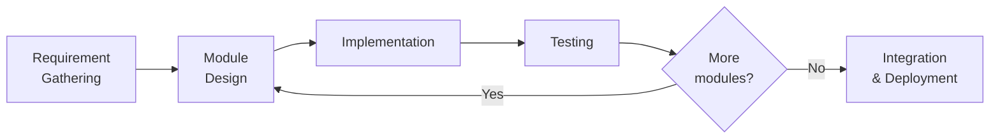

# Chapter 1 — Introduction

## 1.1 Introduction

Customer support is one of the most repetitive and expensive operations for any company. Most
customer questions — pricing, opening hours, product details, results, policies — are answered
again and again by human agents. Recent advances in Large Language Models (LLMs) make it
possible to automate this reliably, but building an AI chat system requires machine-learning
expertise, infrastructure, and integration effort that most small and medium companies in Nepal
do not have.

**Perai** solves this by providing AI customer-support **as a service**. A company simply:

1. Registers on the Perai portal and receives an account with an API key.
2. Uploads its own knowledge (FAQs, product data, notices) as JSONL records.
3. Embeds the ready-made chat widget on its website, or calls the REST API directly.

From that moment, visitors of the company's website can chat with an AI assistant that answers
in the company's own tone and language, grounded in the company's own knowledge base. Usage is
metered per token and charged from a prepaid credit balance, which can be topped up online
through the **Khalti** payment gateway.

## 1.2 Problem Statement

- Companies answer the same customer questions repeatedly, consuming staff time.
- Off-the-shelf chatbots follow rigid decision trees and cannot answer free-form questions.
- Building a custom LLM chatbot per company is costly: vector databases and embedding
  pipelines demand heavy infrastructure.
- Existing global SaaS chatbots do not support local payment methods (Khalti/eSewa) or
  Nepali-language configuration, making them impractical for Nepali businesses.

## 1.3 Objectives

The main objectives of this project are:

1. To develop a **multi-tenant platform** where each company manages its own isolated
   knowledge base, settings, API keys, and billing.
2. To implement a **low-cost RAG technique** (vectorless, BM25-based file retrieval) that
   grounds LLM answers in company knowledge without a vector database.
3. To implement **token-based metering and prepaid billing**, with online top-up through the
   **Khalti ePayment gateway**.
4. To provide an **embeddable chat widget** and a documented **REST API** so companies can
   integrate the assistant with minimal effort.

## 1.4 Scope and Limitations

### Scope

- Company registration, JWT login, and profile management.
- Knowledge-base upload (JSONL, append/replace modes) with instant availability.
- AI chat with company tone/language settings, streaming responses, and optional TTS audio.
- API key management (create, revoke, expiry) for external integration.
- Balance dashboard: usage history, top-up history, Khalti payment integration.
- Support ticket system between companies and the platform.

### Limitations

- Retrieval is keyword/BM25 based; it does not use semantic embeddings, so paraphrased
  queries with no overlapping keywords may retrieve weaker context.
- The LLM is consumed from a third-party inference provider (Groq); the platform does not
  train or host its own model.
- Payment integration currently supports Khalti only (eSewa and cards are future work).
- The chat widget supports one language per company at a time (English or Nepali).

## 1.5 Development Methodology

The project was developed using an **incremental (agile-style) methodology**: the system was
divided into modules (authentication, finetune/knowledge base, chat, billing, tickets) and each
module was analyzed, implemented, and tested before moving to the next. Version control was
maintained with Git/GitHub throughout.

## 1.6 Report Organization

- **Chapter 1** introduces the project, its problems, objectives, and scope.
- **Chapter 2** analyzes requirements and feasibility, and models use cases.
- **Chapter 3** presents the system design: architecture, flowcharts, and DFDs.
- **Chapter 4** presents the database design and normalization (1NF → 3NF).
- **Chapter 5** describes implementation tools, modules, and testing.
- **Chapter 6** concludes the report and lists future enhancements.
