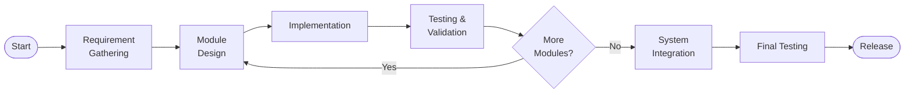

# Chapter 1: Introduction

## 1.1 Introduction

Customer support is one of the most resource-intensive and repetitive operations for any business. Whether a school answering questions about admission, a company explaining its products, or a bank clarifying loan terms — the same questions are asked hundreds of times daily by different customers. Staffing human agents to handle these repetitive interactions is expensive, error-prone, and difficult to scale. Recent advances in Large Language Models (LLMs) have made it technically feasible to automate such interactions accurately and naturally.

However, deploying an LLM-based chatbot from scratch requires significant technical expertise: engineers must set up vector databases, embedding pipelines, prompt engineering workflows, API infrastructure, authentication systems, billing logic, and frontend dashboards. For most small and medium enterprises — especially in Nepal — this investment is prohibitive.

**Perai** addresses this gap by providing AI customer-support **as a service**. It is a multi-tenant B2B platform where any company can:

1. Register and receive a company account with a prepaid credit balance.
2. Upload its own knowledge base (product FAQs, policies, results, schedules) as JSONL records through a web dashboard.
3. Immediately receive a branded chat widget to embed on its own website, and a REST API secured by hashed API keys for direct integration.

From that moment onward, end users visiting the company's website can interact with an AI assistant that responds in the company's configured tone (formal, casual, friendly, or professional) and language (English or Nepali), with responses grounded in the company's own knowledge base using a vectorless Retrieval-Augmented Generation (RAG) technique. Usage is billed per token and deducted from a prepaid USD credit balance, which can be topped up online through the **Khalti ePayment** gateway — the first locally integrated payment method for a Nepali AI SaaS platform of this type.

The system is built with modern industry-standard technologies: **FastAPI** (Python) for the backend, **Next.js** (TypeScript) for the frontend dashboard, and **PostgreSQL** as the relational database. The entire schema is designed in Third Normal Form (3NF) with multi-tenant row-level isolation.

## 1.2 Problem Statement

The following specific problems motivate the development of Perai:

1. **Repetitive customer support burden:** Companies spend significant staff time answering the same customer questions repeatedly, diverting resources from higher-value activities.

2. **Limitation of rule-based chatbots:** Existing rule-based or decision-tree chatbots cannot answer open-ended, free-form customer questions. They require extensive scripting and break down when users phrase questions unexpectedly.

3. **High infrastructure cost for LLM chatbots:** Building a custom LLM-powered chatbot requires a vector database, embedding model hosting, and GPU inference infrastructure — costs that most Nepali businesses cannot justify.

4. **No local payment integration:** Global SaaS chatbot platforms charge in USD via international cards, which many Nepali companies and individuals do not possess. Local gateways like Khalti are not supported by any comparable existing platform.

5. **Language and tone limitation:** Existing chatbot platforms do not support Nepali language or configurable company tone, making them culturally mismatched for the Nepali market.

6. **No multi-tenancy with company isolation:** Generic LLM wrappers do not provide per-company knowledge isolation, billing, and API key management needed for a B2B product.

## 1.3 Objectives

The main objectives of this project are:

1. To design and develop a **multi-tenant SaaS platform** where each company manages its own isolated knowledge base, AI settings, API keys, and credit balance through a web dashboard.

2. To implement a **vectorless RAG system** using BM25 keyword ranking over per-company JSONL knowledge files, enabling grounded AI responses without a vector database or embedding model.

3. To implement **token-based metering and prepaid billing** with a reserve-then-finalize charging model that accurately bills per LLM request and refunds unused reserved credits.

4. To integrate **Khalti ePayment gateway** for NPR-denominated top-ups of USD credit balance, with server-side idempotent payment verification preventing double-crediting.

5. To provide an **embeddable JavaScript chat widget** and a fully documented **REST API** (with code snippets in TypeScript, Python, and cURL) enabling companies to integrate the AI assistant with minimal development effort.

6. To design and implement a **normalized relational database schema** (3NF) with Alembic-managed migrations, ensuring data integrity, scalability, and maintainability.

## 1.4 Scope and Limitation

### Scope

The following features are within the scope of this project:

- Company registration, email-based JWT login, profile management, and password security using bcrypt hashing.
- Knowledge base management: JSONL file upload in append or replace mode, with per-company storage and instant availability for chat retrieval.
- AI chat endpoint: streaming and non-streaming responses grounded in company knowledge, configurable tone, language, and token limit per company.
- Optional Text-to-Speech (TTS) audio output per chat response (WAV format, Supertonic/ONNX model).
- API key management: creation, listing, revocation, expiry, and hashed storage.
- Balance and billing: credit reservation per request, token-cost finalization, deduction logging, and balance dashboard.
- Khalti payment integration: initiate payment, redirect to Khalti, return with pidx, server-side lookup verification, idempotent balance crediting.
- Support ticket system: create, view, update status, and track open/close history.
- Company dashboard: 14 pages covering all modules (dashboard overview, finetune, models, chat, sessions, balance, usage, integration, widget, API keys, settings, tickets, profile).
- Automated test suite (pytest) covering authentication, balance, Khalti payment flow, API keys, and chat.

### Limitation

- **Retrieval quality:** BM25 keyword-based retrieval does not capture semantic similarity. Paraphrased queries with no overlapping keywords may retrieve weaker or irrelevant context. Semantic embedding-based retrieval (e.g., pgvector) is a future enhancement.
- **LLM dependency:** The system relies on a third-party LLM inference provider (Groq). Any outage or price change at Groq directly affects the platform. The platform does not train or fine-tune its own model.
- **Payment method:** Only Khalti gateway is integrated. Companies requiring eSewa, bank transfer, or international card payments must wait for future integration.
- **Language support:** Each company can configure a single language (English or Nepali) for AI responses. Per-user automatic language detection is not yet implemented.
- **Single knowledge file per company:** Each company has one JSONL knowledge file; multiple document types or hierarchical knowledge structures are not yet supported.
- **Audio generation latency:** TTS audio is generated synchronously and can add 3–10 seconds to response time for longer replies.

## 1.5 Development Methodology

This project was developed using an **Incremental Development Methodology**, which is a software development approach where the system is designed, implemented, and tested in small increments — each increment delivering a working, testable subset of the final system. This methodology was chosen because:

- It allows early detection of problems before the full system is built.
- Each module (authentication, knowledge base, chat, billing, payment, tickets) can be independently tested.
- Progress is measurable at each increment, which is important for academic project milestones (proposal → midterm → final).

The following figure illustrates the development cycle followed in this project:

**Figure 1.1: Incremental Development Methodology**

The modules were developed in the following order:

| Increment | Module | Deliverable |
|-----------|--------|-------------|
| 1 | Authentication | Registration, login, JWT, API keys |
| 2 | Knowledge Base | JSONL upload, BM25 RAG store |
| 3 | AI Chat | Streaming chat, metering |
| 4 | Billing | Balance, reserve/finalize, top-up |
| 5 | Khalti Payment | Initiate, verify, idempotent credit |
| 6 | Support Tickets | Create, track, close |
| 7 | Dashboard | Frontend pages, widget, integration |

## 1.6 Report Organization

This report is organized into five chapters as prescribed by the CACS452 course guideline:

- **Chapter 1 — Introduction:** Introduces the project, states the problem, defines objectives, describes scope and limitations, and explains the development methodology.

- **Chapter 2 — Background Study and Literature Review:** Provides the theoretical background of the key technologies used (LLM, RAG, multi-tenancy, payment systems) and reviews similar existing systems.

- **Chapter 3 — System Analysis and Design:** Covers requirement analysis (functional and non-functional requirements, use case diagrams and descriptions), feasibility analysis, object modelling (class and object diagrams), dynamic modelling (state and sequence diagrams), process modelling (activity diagrams), and system design (component and deployment diagrams).

- **Chapter 4 — Implementation and Testing:** Describes the tools and technologies used, provides implementation details of each module, presents unit and system test cases and results, and includes result analysis.

- **Chapter 5 — Conclusion and Future Recommendations:** Concludes the report with lessons learned and recommends future enhancements.
