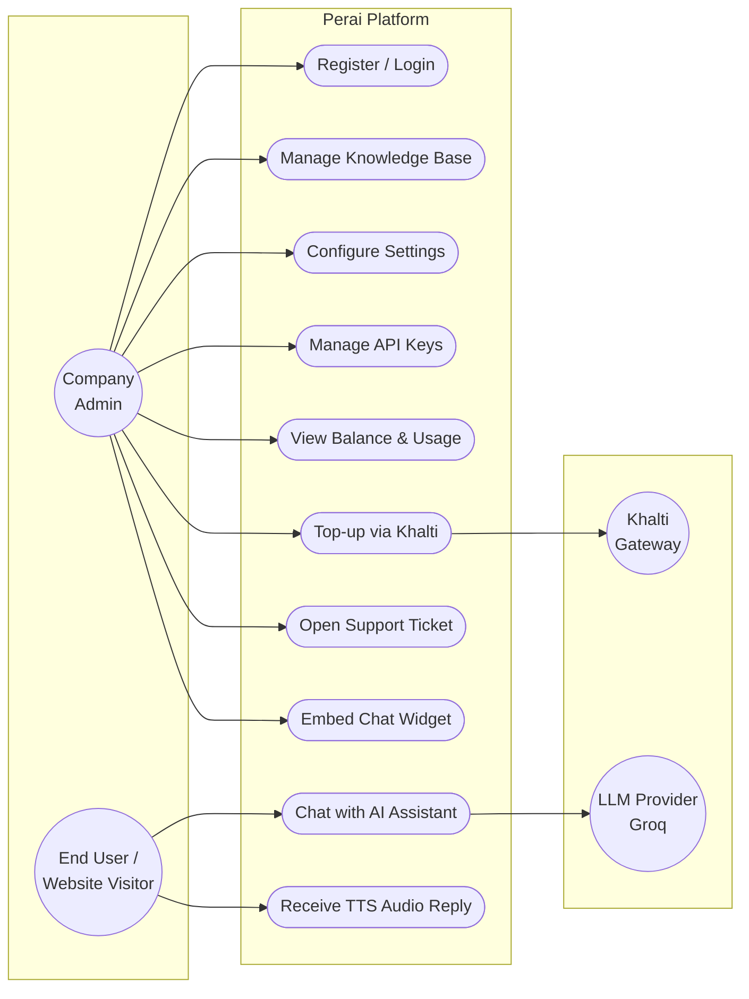

# Chapter 2 — System Analysis

## 2.1 Requirement Analysis

### 2.1.1 Functional Requirements

| ID | Requirement | Description |
|----|-------------|-------------|
| FR1 | Company registration | A company can register with name, email, and password. |
| FR2 | Authentication | A company can log in and receive a JWT access token; a default API key is issued automatically. |
| FR3 | Knowledge base upload | A company can upload JSONL records (question/answer, title/content, or text) in **append** or **replace** mode. |
| FR4 | AI chat | End users can send messages; the system retrieves relevant knowledge (BM25), calls the LLM, and returns a grounded reply (optionally streamed, optionally with TTS audio). |
| FR5 | Company settings | A company can configure language (English/Nepali), tone (formal/casual/friendly/professional), and max reply tokens. |
| FR6 | API key management | A company can create, list, revoke, and delete API keys with expiry dates. |
| FR7 | Balance & metering | Every chat request reserves credits, deducts the actual token cost, and records the deduction. |
| FR8 | Khalti top-up | A company can pay through Khalti; on verified payment the USD credit balance is increased exactly once. |
| FR9 | Usage history | A company can view top-ups, deductions, and per-session chat history. |
| FR10 | Support tickets | A company can open, track, and close support tickets. |
| FR11 | Widget embed | A company can copy an HTML snippet that embeds the branded chat widget on its own website. |

### 2.1.2 Non-Functional Requirements

| ID | Requirement | Description |
|----|-------------|-------------|
| NFR1 | Security | Passwords hashed (bcrypt); JWT for dashboard; hashed API keys for integrations; per-company resource isolation (403 on cross-company access). |
| NFR2 | Performance | Vectorless RAG (file-based BM25) avoids embedding computation; typical chat response begins streaming within ~1 second. |
| NFR3 | Scalability | Stateless API servers; multi-tenant single database with per-company row isolation. |
| NFR4 | Reliability | Payment crediting is idempotent — a verified Khalti payment can never be credited twice. |
| NFR5 | Usability | Responsive dashboard UI (Next.js + shadcn/ui) usable on desktop and mobile. |
| NFR6 | Maintainability | Layered architecture (route → service → model), Alembic migrations, automated pytest suite. |
| NFR7 | Rate limiting | Per-endpoint rate limits (e.g., 60 chat requests/minute) prevent abuse. |

## 2.2 Feasibility Study

### 2.2.1 Technical Feasibility

All chosen technologies (Python/FastAPI, Next.js, PostgreSQL, SQLAlchemy) are free, mature,
and well documented. LLM inference is consumed through a hosted API (Groq), so no GPU
infrastructure is needed. The vectorless RAG design deliberately avoids a vector database,
keeping the stack simple enough for a single developer. **Technically feasible.**

### 2.2.2 Economic Feasibility

The system runs on free/open-source software; the only variable cost is per-token LLM
inference, which is passed on to companies through the prepaid credit system with a margin.
Khalti charges a small transaction fee per top-up. Development cost is limited to developer
time. **Economically feasible.**

### 2.2.3 Operational Feasibility

Company staff need no AI knowledge — uploading a JSONL file (a sample is downloadable from the
dashboard) and copying a widget snippet are the only required operations. The dashboard mirrors
familiar SaaS patterns. **Operationally feasible.**

### 2.2.4 Schedule Feasibility

The modular scope (auth → knowledge base → chat → billing → tickets) fits within one academic
semester, with each module independently testable. **Schedule feasible.**

## 2.3 Use Case Diagram

## 2.4 Use Case Descriptions (Key Cases)

### UC6 — Top-up via Khalti

| Item | Description |
|------|-------------|
| Actor | Company Admin |
| Precondition | Company is logged in. |
| Main flow | 1. Admin selects a credit package (e.g., $5, $10, $25). 2. System initiates a Khalti payment and stores the payment record (`pidx`). 3. Admin is redirected to Khalti and completes payment. 4. Khalti redirects back with `pidx`. 5. System verifies the payment with Khalti's lookup API. 6. If status = *Completed* and amount matches, balance is credited once and shown to the admin. |
| Alternate flow | Payment cancelled/pending → system shows status, no credit. Amount mismatch → payment flagged, no credit. Repeated verify → no double credit. |
| Postcondition | Balance increased by the package amount exactly once; top-up appears in history. |

### UC9 — Chat with AI Assistant

| Item | Description |
|------|-------------|
| Actor | End User (via widget or API) |
| Precondition | Valid API key; company balance sufficient. |
| Main flow | 1. User sends a message. 2. System authenticates the API key and reserves estimated credits. 3. Relevant knowledge records are retrieved (BM25 + exact ID/name match). 4. A prompt is built with company tone/language and the retrieved context. 5. The LLM generates the reply (streamed). 6. Actual token cost is finalized against the reservation; the message is logged. |
| Alternate flow | Insufficient balance → 402-style error, no LLM call. LLM provider failure → fallback API keys tried, then error returned and reservation released. |
| Postcondition | Reply delivered; deduction recorded; session history updated. |
