# Chapter 3: System Analysis and Design

## 3.1 System Analysis

### 3.1.1 Requirement Analysis

#### i. Functional Requirements

**Table 3.1: Functional Requirements**

| Req. ID | Requirement | Description |
|---------|-------------|-------------|
| FR-01 | Company Registration | A company can register by providing company name, email, and password. The system creates a company account, issues a starting balance, and auto-generates a default API key. |
| FR-02 | Company Login | A company authenticates using email and password. On success, the system returns a signed JWT access token valid for 60 minutes. |
| FR-03 | Knowledge Base Upload | A company uploads JSONL records (one JSON object per line: question/answer, title/content, or text). The system validates each line, normalizes records, and writes them to a per-company RAG file in append or replace mode. |
| FR-04 | AI Chat (Streaming) | An end user sends a text message with a valid API key. The system retrieves relevant knowledge (BM25 + exact match), builds a prompt incorporating company tone and language settings, calls the LLM, and streams tokens back to the client using Server-Sent Events. |
| FR-05 | AI Chat (Non-Streaming) | Same as FR-04 but returns the complete response as a single JSON object, with optional base64-encoded WAV audio (TTS). |
| FR-06 | Company Settings | A company configures language (english/nepali), tone (formal/casual/friendly/professional), and maximum reply tokens (50–1000). |
| FR-07 | API Key Management | A company creates, lists, revokes, and deletes API keys. Each key has a name, preview (first 4 and last 4 chars), SHA-256 hash, status (active/revoked), and expiry date. |
| FR-08 | Balance Query | A company views its current USD credit balance. |
| FR-09 | Balance Top-up (Manual) | A company admin can add free credits in development mode. |
| FR-10 | Khalti Payment Initiate | A company selects a credit package (e.g., $5, $10, $25) and initiates a Khalti ePayment. The system converts USD to NPR paisa, calls Khalti's initiate API, stores the payment record, and returns a payment URL for browser redirect. |
| FR-11 | Khalti Payment Verify | After Khalti redirects the user back with a `pidx`, the system calls Khalti's lookup API to verify the payment status. If status is *Completed* and the paid amount matches, the USD balance is credited exactly once (idempotent). |
| FR-12 | Usage History | A company views per-request deduction history (amount, tokens, model, timestamp). |
| FR-13 | Top-up History | A company views a list of all balance top-ups with amounts and references. |
| FR-14 | Chat Session History | A company views all chat sessions with message logs, token usage, and timestamps. |
| FR-15 | Support Ticket Create | A company creates a support ticket with an issue description and category (payment/technical/general). |
| FR-16 | Support Ticket Track | A company views ticket status (open/closed) and open/close history. |
| FR-17 | Chat Widget Embed | A company copies an HTML snippet to embed a branded chat widget on its website. |
| FR-18 | Company Dashboard | An overview page shows current balance, model status, active API keys, and recent activity. |

**Use Case Diagram**

**Figure 3.1: Use Case Diagram**

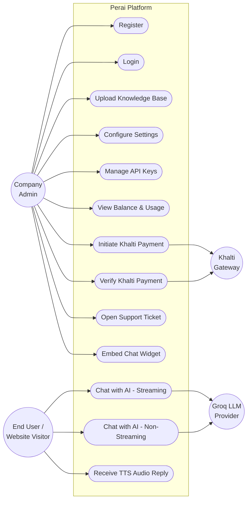

**Use Case Descriptions**

**Table 3.3: Use Case Description – Register/Login**

| Field | Description |
|-------|-------------|
| Use Case Name | Register and Login |
| Actor | Company Admin |
| Precondition | No account exists for the email address. |
| Main Flow | 1. Admin fills registration form (company name, email, password). 2. System validates inputs. 3. System hashes password using bcrypt. 4. System creates company row, balance row (with starting credit), settings row, and default API key. 5. System redirects to login. 6. Admin enters email and password. 7. System verifies password hash. 8. System issues JWT. 9. Admin is redirected to dashboard. |
| Alternate Flow | Duplicate email → 400 error. Weak password (<8 chars) → validation error. Wrong password → 401 error. |
| Postcondition | Company account created; JWT issued; dashboard accessible. |

**Table 3.4: Use Case Description – Khalti Top-up**

| Field | Description |
|-------|-------------|
| Use Case Name | Balance Top-up via Khalti |
| Actor | Company Admin |
| Precondition | Company is logged in. Khalti secret key configured on server. |
| Main Flow | 1. Admin selects a credit package amount (e.g., $5 = NPR 700). 2. System calls `POST /epayment/initiate/` with NPR paisa amount. 3. Khalti returns `pidx` + `payment_url`. 4. System stores `khalti_payment` row (status=Initiated). 5. Browser redirects to Khalti payment page. 6. Admin completes payment using Khalti wallet or bank. 7. Khalti redirects browser to `/balance?pidx=<pidx>`. 8. Frontend calls `POST /companyBalance/{id}/khalti/verify`. 9. System calls Khalti lookup API. 10. If status=Completed and amount matches, system credits balance once and stores `balance_topup` row with reference `khalti:<pidx>`. 11. New balance shown. |
| Alternate Flow | Payment cancelled/pending → status shown, no credit. Amount mismatch → payment flagged, no credit, error shown. Verify called twice → second call is no-op (idempotent). |
| Postcondition | Balance increased by package amount exactly once; top-up appears in history. |

**Table 3.5: Use Case Description – AI Chat**

| Field | Description |
|-------|-------------|
| Use Case Name | Chat with AI Assistant |
| Actor | End User (via widget or direct API call) |
| Precondition | Valid active API key with `X-API-Key` header. Company has sufficient balance. |
| Main Flow | 1. User sends message to `POST /company/{id}/chat/query`. 2. System validates API key (hash lookup). 3. System reserves estimated credits from balance. 4. System retrieves top-K records from company's RAG file (BM25). 5. System builds prompt with company tone, language, max tokens, and retrieved context. 6. System calls Groq LLM (with fallback to backup API keys on failure). 7. System returns streamed or complete response. 8. System finalizes cost: refunds unused reserved credits or deducts extra. 9. System logs chat_message and balance_deduct rows. |
| Alternate Flow | Insufficient balance → 402 error, no LLM call. Invalid key → 401 error. LLM provider failure → fallback keys tried; if all fail, reservation released and error returned. |
| Postcondition | AI reply delivered; deduction logged; session history updated. |

#### ii. Non-Functional Requirements

**Table 3.2: Non-Functional Requirements**

| Req. ID | Category | Requirement |
|---------|----------|-------------|
| NFR-01 | Security | Passwords stored as bcrypt hashes. API keys stored as SHA-256 hashes. JWT signed with secret key. Per-company resource isolation enforced at the application layer (403 on cross-company access). |
| NFR-02 | Performance | Vectorless BM25 retrieval completes in <10ms for knowledge bases up to 5,000 records. LLM streaming begins within 1 second of request. |
| NFR-03 | Reliability | Khalti payment crediting is idempotent: a payment verified twice is credited exactly once. LLM API key rotation provides fallback if primary key fails. |
| NFR-04 | Scalability | Stateless REST API supports horizontal scaling. Row-level multi-tenancy allows unlimited companies on one database instance. |
| NFR-05 | Usability | Dashboard UI is responsive (mobile + desktop), using accessible shadcn/ui components. Empty states shown when no data exists (no raw 404 errors in UI). |
| NFR-06 | Maintainability | Layered architecture (route → service → ORM model). Database schema versioned with Alembic migrations. TypeScript types enforced across frontend codebase. |
| NFR-07 | Availability | API rate limiting (60 requests/minute for chat, 120/minute default) prevents abuse and ensures availability for all tenants. |
| NFR-08 | Portability | SQLAlchemy ORM abstracts the database engine; system runs on PostgreSQL (production) and SQLite (local development/testing) with no code changes. |

---

### 3.1.2 Feasibility Analysis

**Table 3.6: Feasibility Analysis Summary**

| Dimension | Assessment | Conclusion |
|-----------|-----------|------------|
| Technical | All technologies are free, open-source, and well-documented. LLM inference is via hosted API (no GPU required). Vectorless RAG eliminates the need for a vector database. | **Feasible** |
| Operational | Company staff need no AI knowledge. The only required actions are uploading a JSONL file (sample provided) and copying a widget snippet. Dashboard is self-service. | **Feasible** |
| Economic | No infrastructure cost for the student developer. Variable costs (Groq API, Khalti transaction fee) are passed to tenants via the credit billing system. | **Feasible** |
| Schedule | The modular incremental approach (7 modules) fits within one academic semester. Each module is independently deployable and testable. | **Feasible** |

#### i. Technical Feasibility

Perai uses entirely proven, production-ready technologies:
- **FastAPI** (Python) — used in production at Uber, Netflix, Microsoft.
- **Next.js** — powers Vercel, TikTok, Hulu dashboards.
- **PostgreSQL** — the world's most advanced open-source relational database.
- **Groq Llama 3.3 70B** — publicly available inference API with documented pricing and rate limits.
- **Khalti ePayment API v2** — in production use by numerous Nepali e-commerce and educational platforms.

The vectorless BM25 approach is technically simpler than standard RAG — it requires only standard file I/O and a text-processing library, well within Python's standard capabilities.

#### ii. Operational Feasibility

The system is designed for non-technical company administrators. The dashboard walkthrough is:
1. Register → automatic setup (no configuration required).
2. Finetune page → upload JSONL file → knowledge instantly live.
3. Widget page → copy one line of HTML → paste into company website.
4. Balance page → select package → pay via Khalti → credits added automatically.

All complex operations (hashing, JWT, LLM calls, RAG retrieval, billing) are handled invisibly by the backend.

#### iii. Economic Feasibility

**Development cost:** Zero (student project using free tools and open-source software). **Operational cost (per company):** Approximately $0.0006–0.002 per chat request (Groq token cost). **Revenue model:** Companies purchase prepaid credits at a margin above cost. **Payment processing:** Khalti charges approximately 2% per transaction. This model is economically self-sustaining once deployed.

#### iv. Schedule Feasibility

The project was completed within one academic semester using the following timeline:

| Week | Activity |
|------|----------|
| 1–2 | Requirement gathering, system design |
| 3–4 | Authentication and company management (Increment 1–2) |
| 5–6 | Knowledge base and RAG (Increment 3) |
| 7–8 | AI chat with metering (Increment 4) |
| 9–10 | Billing and Khalti integration (Increment 5) |
| 11–12 | Tickets and dashboard frontend (Increment 6–7) |
| 13–14 | Testing, documentation, and report writing |

---

### 3.1.3 Object Modelling using Class and Object Diagrams

**Figure 3.2: Class Diagram**

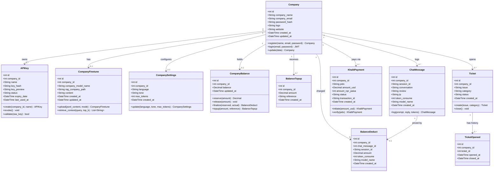

**Figure 3.3: Object Diagram – Company and Balance**

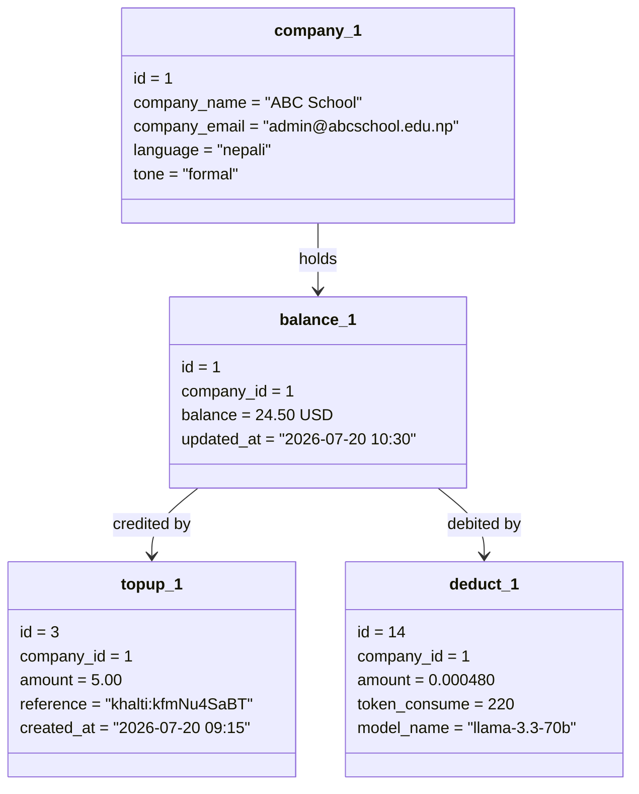

---

### 3.1.4 Dynamic Modelling using State and Sequence Diagrams

**Figure 3.4: State Diagram – Khalti Payment**

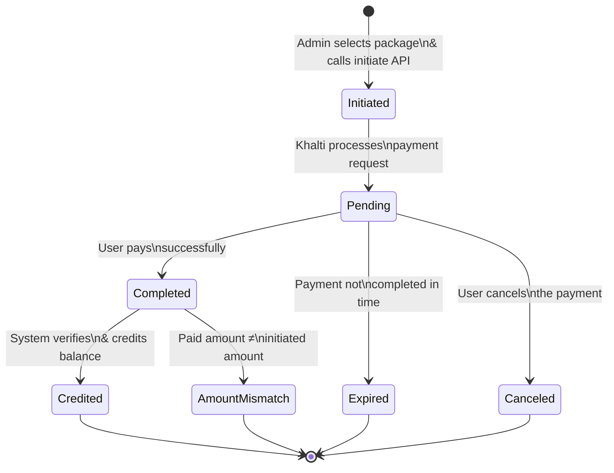

**Figure 3.5: State Diagram – Chat Session**

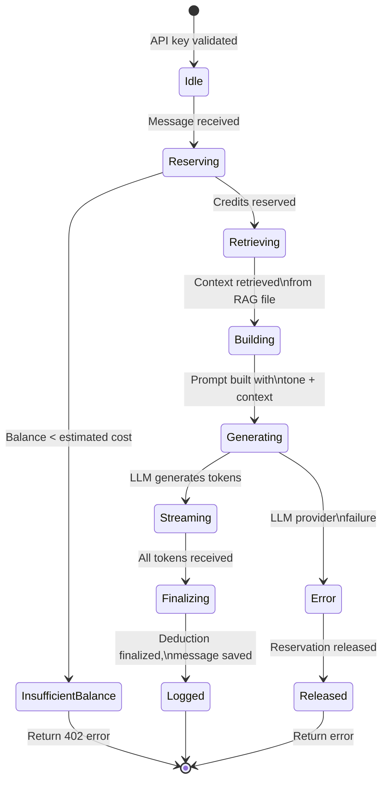

**Figure 3.6: Sequence Diagram – Company Registration and Login**

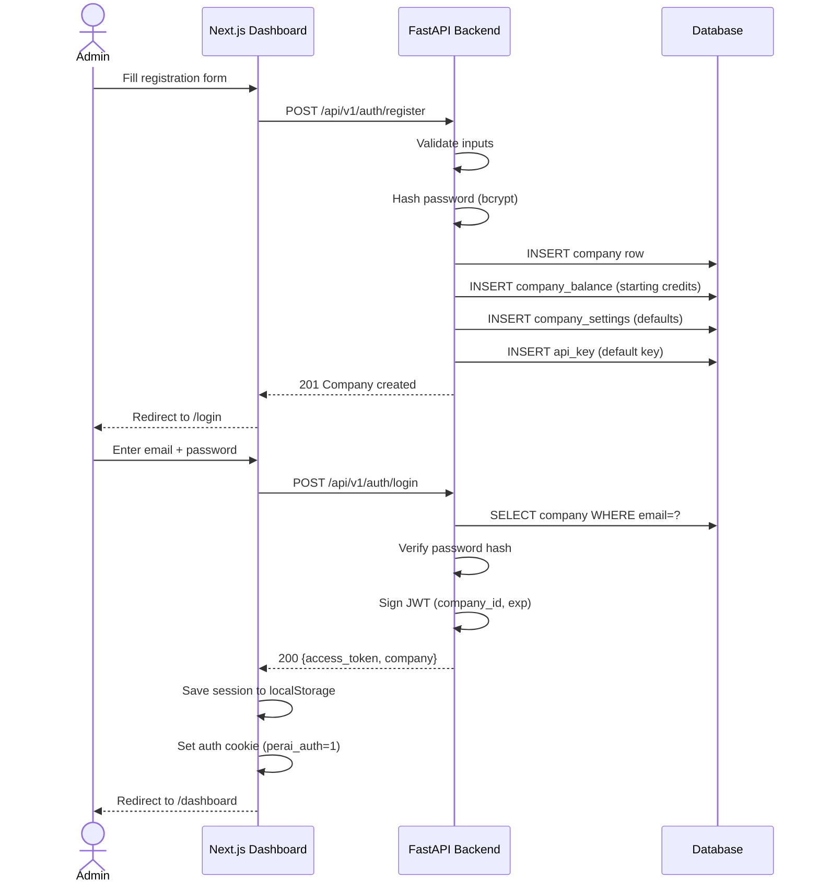

**Figure 3.7: Sequence Diagram – AI Chat Request (Streaming)**

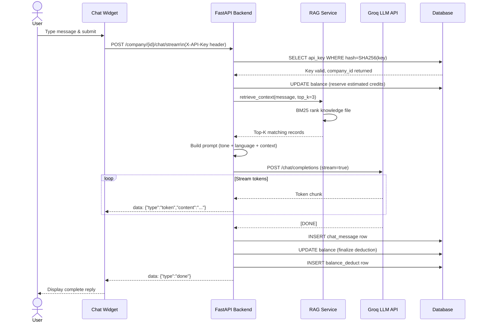

**Figure 3.8: Sequence Diagram – Khalti Balance Top-up**

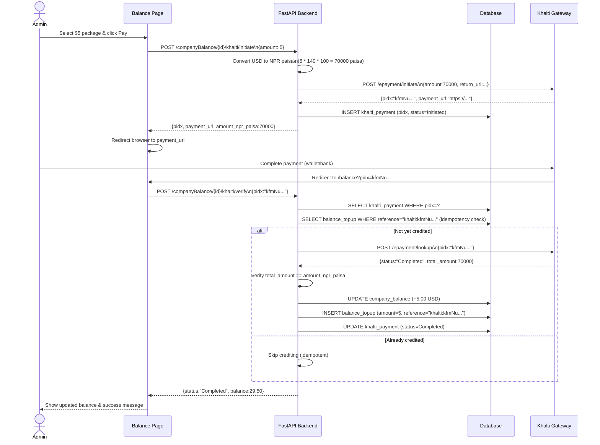

---

### 3.1.5 Process Modelling using Activity Diagrams

**Figure 3.9: Activity Diagram – Knowledge Base Upload**

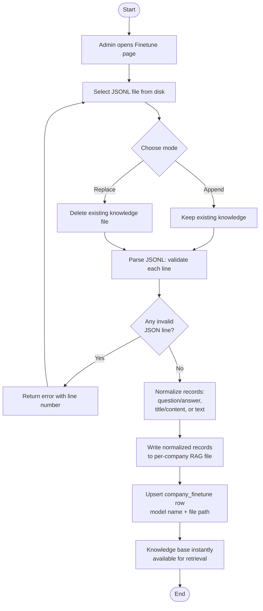

**Figure 3.10: Activity Diagram – Complete Chat Request Flow**

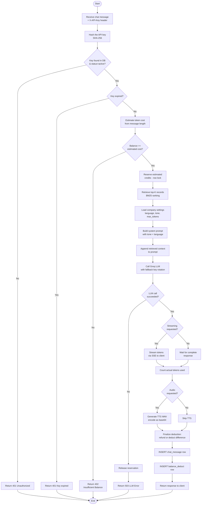

---

## 3.2 System Design

### 3.2.1 Refinement of Class, Object, State, Sequence and Activity Diagrams

After analysis, the following refinements were applied during system design:

1. **Class refinement:** The `CompanyBalance` class was separated from `Company` to allow balance updates without locking the company record. A `with_for_update()` row lock is applied to `company_balance` during reserve and finalize operations to prevent race conditions under concurrent requests.

2. **KhaltiPayment refinement:** The `reference` field on `BalanceTopup` is the primary idempotency guard (value: `"khalti:<pidx>"`). Before crediting, the system checks for an existing `BalanceTopup` row with this reference — this is faster and more reliable than checking `KhaltiPayment.status` alone, since it is set in the same transaction as the credit.

3. **Chat state refinement:** The streaming and non-streaming paths share the same reservation and finalization logic; only the response delivery mechanism differs (`StreamingResponse` vs. `JSONResponse`).

4. **Sequence refinement:** The API key lookup was moved to the earliest possible point in the chat pipeline (before any DB writes or LLM calls) to fail fast and avoid unnecessary work on invalid requests.

### 3.2.2 Component Diagrams

**Figure 3.11: Component Diagram**

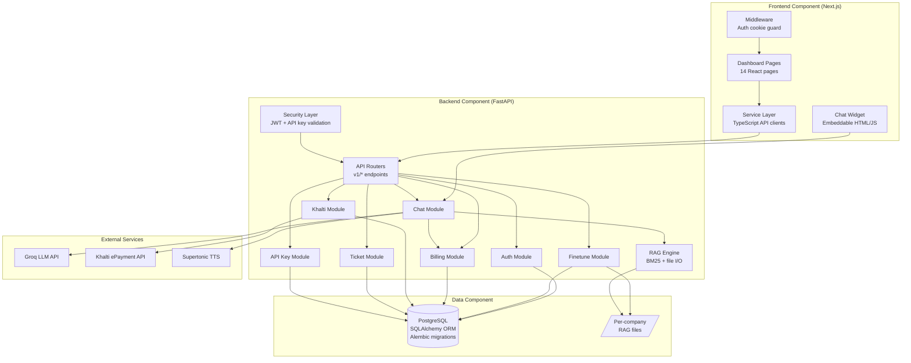

### 3.2.3 Deployment Diagrams

**Figure 3.12: Deployment Diagram**

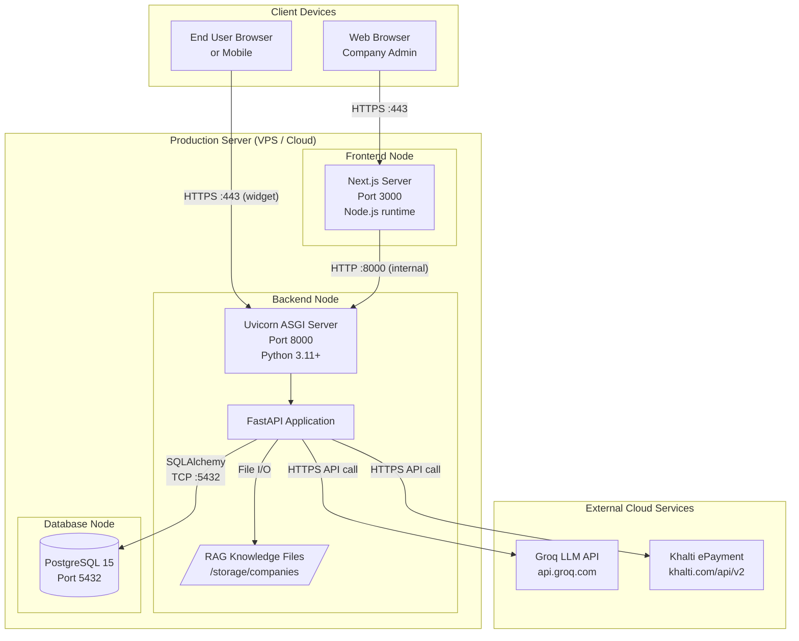

---

## 3.3 Algorithm Details

### 3.3.1 BM25 Retrieval Algorithm

The knowledge retrieval algorithm used in Perai's RAG engine is described below:

**Input:** User query `Q`, company knowledge file (JSONL), `top_k` (default 3)
**Output:** List of at most `top_k` most relevant knowledge records as strings

```
Algorithm: RetrieveContext(Q, knowledge_file, top_k)
1. Load all records from knowledge_file into corpus C
2. Tokenize each record in C into terms → document term vectors
3. Compute corpus statistics:
   a. avgDL = average document length across C
   b. For each term t: IDF(t) = log((N - df(t) + 0.5) / (df(t) + 0.5) + 1)
      where N = |C| and df(t) = number of documents containing t
4. Tokenize Q into query terms [q1, q2, ..., qm]
5. For each document D in C:
   a. Score(D) = 0
   b. For each query term qi:
      Score(D) += IDF(qi) * (f(qi,D) * (k1+1)) / (f(qi,D) + k1*(1-b+b*|D|/avgDL))
      where k1=1.5, b=0.75
6. Sort C by Score(D) descending
7. Additionally: check each document for exact match of any named entity in Q
   (product name, person name, ID number) → boost to top position
8. Return top_k documents as formatted context strings
```

**Complexity:** O(|C| × |Q|) per query — linear in corpus size and query length, typically <5ms for 1,000-record corpora.

### 3.3.2 Idempotent Credit Algorithm

The Khalti payment crediting algorithm guarantees exactly-once balance updates:

```
Algorithm: VerifyAndCredit(db, company_id, pidx)
1. Fetch khalti_payment WHERE pidx = pidx AND company_id = company_id
   IF not found: raise KhaltiError("Unknown payment reference")

2. reference = "khalti:" + pidx
   existing_topup = SELECT balance_topup WHERE reference = reference
   IF existing_topup IS NOT NULL:
     UPDATE khalti_payment SET status = "Completed"
     RETURN current balance  // idempotent: already credited, skip

3. Call Khalti lookup API: POST /epayment/lookup/ {pidx: pidx}
   status = response.status
   paid_amount = response.total_amount

4. UPDATE khalti_payment SET status = status, transaction_id = response.transaction_id

5. IF status != "Completed": RETURN current balance (no credit)

6. IF paid_amount != khalti_payment.amount_npr_paisa:
   UPDATE khalti_payment SET status = "AmountMismatch"
   RAISE KhaltiError("Paid amount does not match")

7. // Credit exactly once within same DB transaction:
   BEGIN TRANSACTION
     UPDATE company_balance SET balance += amount_usd WHERE company_id = company_id
     INSERT INTO balance_topup (company_id, amount, reference) VALUES (company_id, amount_usd, reference)
     UPDATE khalti_payment SET status = "Completed"
   COMMIT

8. RETURN new balance
```

**Key guarantees:**
- Step 2 prevents double-credit if `verify` is called more than once (network retry, browser back button).
- Steps 5–6 prevent partial crediting on failed or mismatched payments.
- Step 7 uses a single database transaction — if any part fails, the entire credit is rolled back.

### 3.3.3 Database Normalization

**Un-normalized Form (UNF) — flat spreadsheet:**

| company_id | company_name | email | api_keys | balance | topup_history | chat_session | tokens | khalti_pids |
|---|---|---|---|---|---|---|---|---|
| 1 | ABC School | admin@abc.edu.np | "sk_a1,sk_b2" | 24.50 | "5 on Jul-19; 10 on Jul-20" | ab12cd | 220 | "kfmNu,pQr7" |

Problems: multi-valued columns, redundancy, deletion/update/insertion anomalies.

**First Normal Form (1NF):** Each attribute atomic, no repeating groups:

| company_id | company_name | email | api_key | topup_amount | topup_date | session_id | tokens | khalti_pidx |
|---|---|---|---|---|---|---|---|---|
| 1 | ABC School | admin@abc.edu.np | sk_a1 | 5.00 | Jul-19 | ab12cd | 220 | kfmNu |
| 1 | ABC School | admin@abc.edu.np | sk_b2 | 5.00 | Jul-19 | ab12cd | 220 | kfmNu |
| 1 | ABC School | admin@abc.edu.np | sk_a1 | 10.00 | Jul-20 | cd34ef | 310 | pQr7 |

✔ Atomic values. ✘ Company facts repeat on every row (partial and transitive dependencies).

**Second Normal Form (2NF):** Remove partial dependencies (facts that depend on only part of the composite key):

- **company_2nf** (*company_id*, company_name, email, language, tone, balance)
- **api_key_2nf** (*company_id, api_key*, status, expiry_date)
- **topup_2nf** (*company_id, topup_date, seq*, amount, reference)
- **chat_2nf** (*session_id, msg_seq*, company_id, tokens, model)
- **khalti_2nf** (*pidx*, company_id, amount_usd, amount_paisa, status)

✔ No partial dependencies. ✘ In `company_2nf`, `balance` is transitively dependent on `topup` events, not on company identity. `language` and `tone` change independently of `email`.

**Third Normal Form (3NF):** Remove transitive dependencies — separate every independent concern:

| Table | Key | Single concern stored |
|-------|-----|-----------------------|
| **company** | id | Identity and credentials |
| **company_settings** | id (FK company_id) | AI configuration |
| **company_balance** | id (FK company_id) | Current credit state |
| **company_finetune** | id (FK company_id) | Knowledge base metadata |
| **api_key** | id | One API key per row |
| **balance_topup** | id | One credit event per row |
| **balance_deduct** | id | One charge event per row |
| **chat_message** | id | One conversation log |
| **company_requests** | id | One metered request |
| **ticket** | id | One support issue |
| **ticket_opened** | id | One open/close event |
| **khalti_payment** | id (pidx unique) | One gateway attempt |

✔ No repeating groups (1NF). ✔ No partial dependencies (2NF). ✔ No transitive dependencies (3NF). Each fact is stored exactly once.

**ER Diagram:**

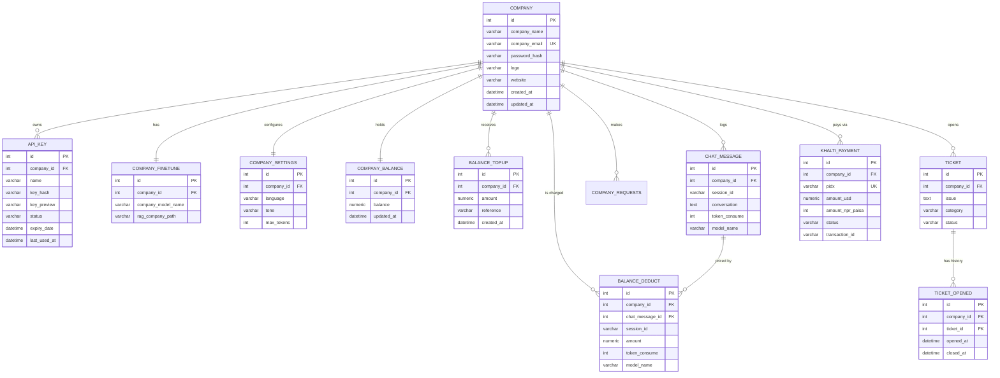
