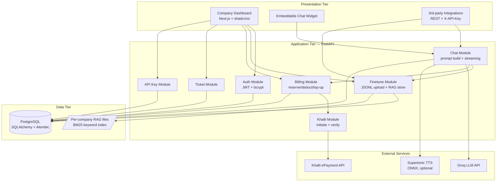
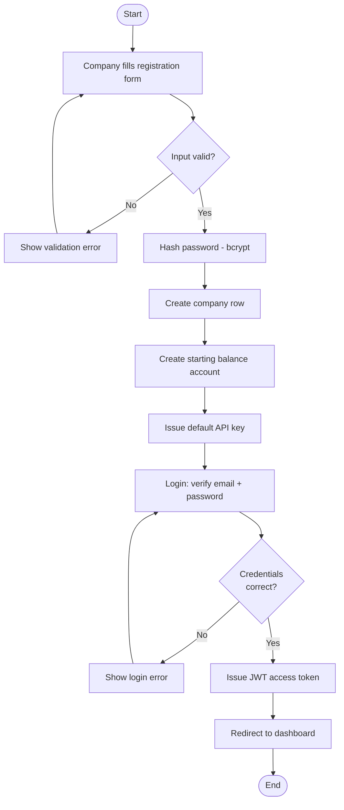
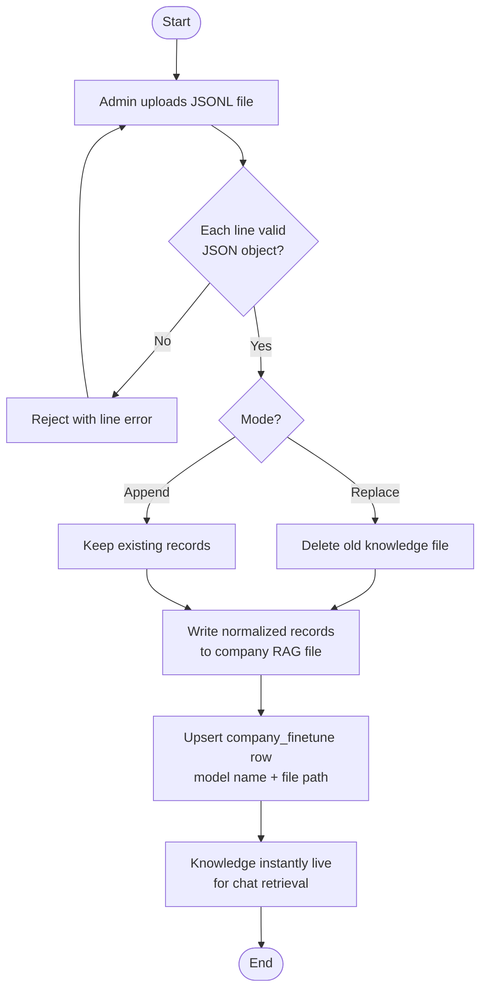
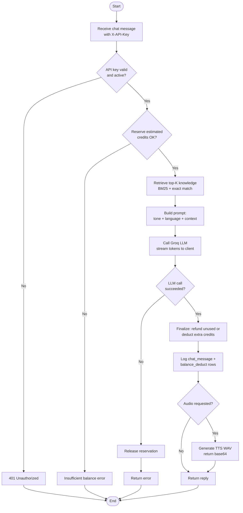
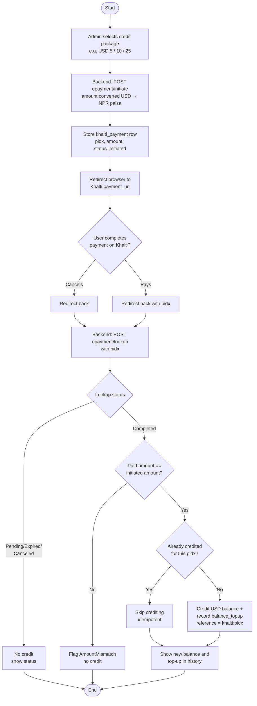
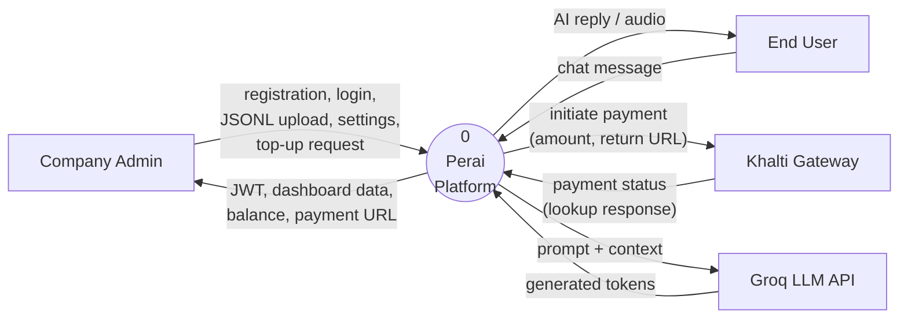
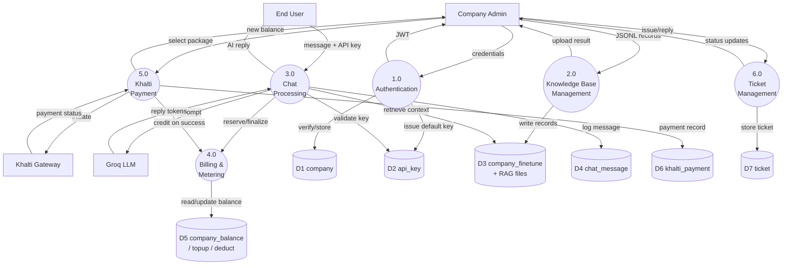
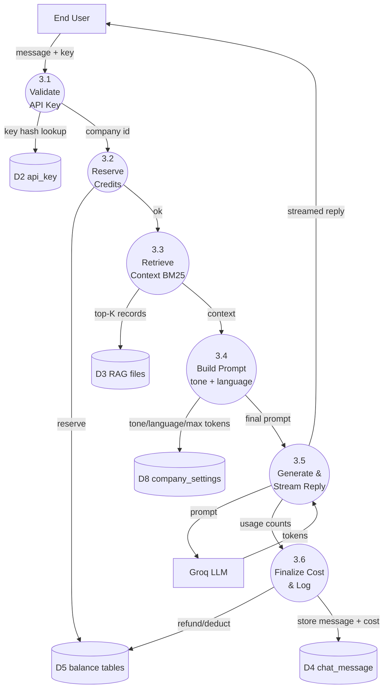
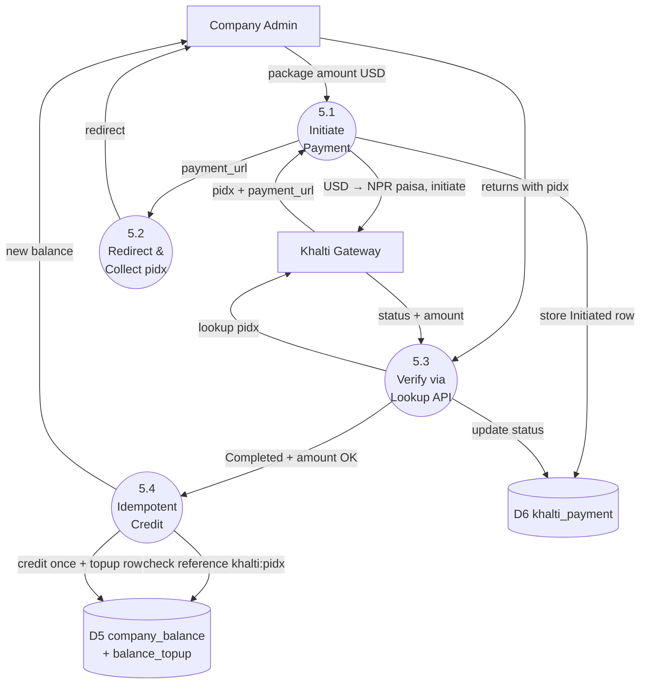

# Chapter 3 — System Design

## 3.1 System Architecture

Perai follows a **three-tier architecture** with clearly separated presentation, application,
and data layers. External services (LLM provider and payment gateway) are integrated at the
application layer.

## 3.2 System Flowcharts

### 3.2.1 Company Registration and Login Flow

### 3.2.2 Knowledge Base (Finetune) Upload Flow

### 3.2.3 AI Chat Request Flow (with metering)

### 3.2.4 Khalti Balance Top-up Flowchart

## 3.3 Data Flow Diagrams

### 3.3.1 DFD Level 0 (Context Diagram)

### 3.3.2 DFD Level 1

### 3.3.3 DFD Level 2 — Process 3.0 (Chat Processing)

### 3.3.4 DFD Level 2 — Process 5.0 (Khalti Payment)

## 3.4 Interface Design (Dashboard Pages)

| Page | Purpose |
|------|---------|
| `/login`, `/register` | Authentication |
| `/dashboard` | Overview: balance, model status, API keys, recent activity |
| `/finetune` | Knowledge base upload (JSONL) and current finetune details |
| `/models` | Company model name and status |
| `/chat` | In-dashboard test chat |
| `/sessions` | Chat session history |
| `/balance` | Balance, credit packages, **Khalti payment**, top-up history |
| `/usages` | Token/credit consumption records |
| `/integration` | Code snippets (TypeScript / Python / cURL) |
| `/widget` | Embeddable widget snippet generator |
| `/api` | API key management |
| `/settings` | Tone, language, max tokens |
| `/ticket` | Support tickets |
