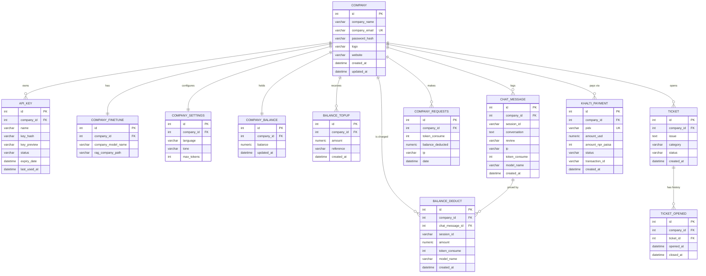

# Chapter 4 — Database Design

The system uses **PostgreSQL** (SQLite for local testing) accessed through the **SQLAlchemy
ORM**, with schema versions managed by **Alembic** migrations. The database has 12 tables, all
isolated per company (multi-tenant row-level isolation via `company_id`).

## 4.1 ER Diagram

## 4.2 Relational Schema

- **company** (<u>id</u>, company_name, company_email, password_hash, logo, website, created_at, updated_at)
- **api_key** (<u>id</u>, *company_id*, name, key_hash, key_preview, status, expiry_date, last_used_at, created_at, updated_at)
- **company_finetune** (<u>id</u>, *company_id*, company_model_name, rag_company_path, created_at, updated_at)
- **company_settings** (<u>id</u>, *company_id*, language, tone, max_tokens, created_at, updated_at)
- **company_balance** (<u>id</u>, *company_id*, balance, updated_at)
- **balance_topup** (<u>id</u>, *company_id*, amount, reference, created_at)
- **balance_deduct** (<u>id</u>, *company_id*, *chat_message_id*, session_id, amount, token_consume, model_name, created_at)
- **chat_message** (<u>id</u>, *company_id*, session_id, conversation, review, ip, token_consume, model_name, created_at, updated_at)
- **company_requests** (<u>id</u>, *company_id*, token_consume, balance_deducted, ip, date)
- **ticket** (<u>id</u>, *company_id*, issue, category, status, created_at, updated_at)
- **ticket_opened** (<u>id</u>, *company_id*, *ticket_id*, opened_at, closed_at, created_at, updated_at)
- **khalti_payment** (<u>id</u>, *company_id*, pidx, amount_usd, amount_npr_paisa, status, transaction_id, created_at, updated_at)

Underlined = primary key, *italic* = foreign key.

## 4.3 Normalization

To demonstrate normalization, consider how the platform's billing/chat data would look if it
were kept as one flat record per chat request, the way a naive spreadsheet design would store it.

### 4.3.1 Un-normalized Form (UNF)

A single flat table storing everything about a company and its activity:

**perai_flat**

| company_id | company_name | company_email | password_hash | api_keys | language | tone | balance | topup_history | chat_session | conversation | token_consume | deduct_amount | khalti_pidx_list |
|---|---|---|---|---|---|---|---|---|---|---|---|---|---|
| 1 | Test Company | test@perai.local | $2b$... | "sk_a1..., sk_b2..." | english | formal | 24.99 | "5 on 2026-07-19; 10 on 2026-07-20" | ab12cd34ef56 | "Q: price? A: ..." | 220 | 0.000480 | "kfmNu4Sa..., pQr7..." |

Problems:

- **Repeating groups** — `api_keys`, `topup_history`, and `khalti_pidx_list` hold multiple
  values in one cell; they cannot be searched or updated atomically.
- **Redundancy** — company name/email/settings repeat on every chat row.
- **Anomalies** — deleting the last chat row would delete the company (deletion anomaly);
  changing the company email requires updating thousands of rows (update anomaly); a company
  cannot exist without at least one chat (insertion anomaly).

### 4.3.2 First Normal Form (1NF)

**Rule:** every attribute must hold a single atomic value; no repeating groups; each row unique.

The multi-valued columns are split into separate rows, giving one row per (company, api_key,
topup, chat, payment) combination — atomic, but heavily redundant:

**perai_1nf**

| company_id | company_name | company_email | language | tone | api_key | topup_amount | topup_date | session_id | conversation | token_consume | deduct_amount | khalti_pidx | khalti_status |
|---|---|---|---|---|---|---|---|---|---|---|---|---|---|
| 1 | Test Company | test@perai.local | english | formal | sk_a1... | 5 | 2026-07-19 | ab12cd34ef56 | Q/A text | 220 | 0.000480 | kfmNu4Sa... | Completed |
| 1 | Test Company | test@perai.local | english | formal | sk_b2... | 5 | 2026-07-19 | ab12cd34ef56 | Q/A text | 220 | 0.000480 | kfmNu4Sa... | Completed |
| 1 | Test Company | test@perai.local | english | formal | sk_a1... | 10 | 2026-07-20 | cd34ef56ab12 | Q/A text | 310 | 0.000710 | pQr7... | Pending |

✔ Atomic values, no repeating groups.
✘ Massive redundancy — company facts, settings, and payment facts are duplicated across rows;
the key is a wide composite (company_id, api_key, topup_date, session_id, khalti_pidx).

### 4.3.3 Second Normal Form (2NF)

**Rule:** 1NF **and** no partial dependency — every non-key attribute must depend on the
*whole* composite key, not on part of it.

In `perai_1nf`, `company_name`, `company_email`, `language`, `tone` depend only on
`company_id` (part of the key); `topup_amount` depends only on (company_id, topup_date);
`khalti_status` depends only on `khalti_pidx`. These partial dependencies are removed by
decomposing into one table per entity:

- **company_2nf** (<u>company_id</u>, company_name, company_email, password_hash, language, tone, max_tokens, balance)
- **api_key_2nf** (<u>company_id, api_key</u>, status, expiry_date)
- **balance_topup_2nf** (<u>company_id, topup_date, seq</u>, amount, reference)
- **chat_message_2nf** (<u>session_id, msg_seq</u>, company_id, conversation, token_consume, deduct_amount, model_name)
- **khalti_payment_2nf** (<u>khalti_pidx</u>, company_id, amount_usd, amount_npr_paisa, status)

✔ Every non-key attribute now depends on its table's full key.
✘ A transitive dependency remains: in **company_2nf**, `balance` is not a fixed fact about the
company — it is derived from top-ups and deductions; and settings (`language`, `tone`,
`max_tokens`) change independently of identity facts. Mixing them still causes update
anomalies (e.g., every chat that changes the balance rewrites the company row).

### 4.3.4 Third Normal Form (3NF)

**Rule:** 2NF **and** no transitive dependency — no non-key attribute may depend on another
non-key attribute.

The remaining transitive/independent groups are separated:

1. `company_2nf` is split into identity (**company**), mutable configuration
   (**company_settings**), and money state (**company_balance**) — each keyed by
   `company_id`, so a settings change or balance change never touches identity data.
2. Chat cost facts are split from chat content: **chat_message** stores the conversation;
   **balance_deduct** stores the money consequence, referencing `chat_message_id`. The
   deducted amount depends on token usage and model price, not on the message identity —
   keeping it separate avoids recomputation anomalies.
3. **khalti_payment** keeps gateway state (`status`, `transaction_id`) keyed by the unique
   `pidx`; the resulting credit is recorded separately in **balance_topup** with
   `reference = 'khalti:<pidx>'`, which also enforces *exactly-once* crediting.

The result is exactly the production schema of Section 4.2:

| 3NF Table | Key | What it stores (single concern) |
|-----------|-----|--------------------------------|
| company | id | Identity & credentials |
| company_settings | id (FK company_id unique) | AI behaviour configuration |
| company_balance | id (FK company_id unique) | Current credit state |
| company_finetune | id (FK company_id unique) | Knowledge-base/model metadata |
| api_key | id | One key per row, hashed |
| balance_topup | id | One credit event per row |
| balance_deduct | id | One charge event per row |
| chat_message | id | One conversation log per row |
| company_requests | id | One metered API request per row |
| ticket / ticket_opened | id | Support issue + open/close history |
| khalti_payment | id (pidx unique) | One gateway payment attempt per row |

✔ No repeating groups (1NF), no partial dependencies (2NF), no transitive dependencies (3NF).
All facts are stored once; balances are updated in one place; deleting activity never deletes
identity; foreign keys with `ON DELETE CASCADE` keep referential integrity.

## 4.4 Data Dictionary (Key Tables)

### company

| Column | Type | Constraint | Description |
|--------|------|-----------|-------------|
| id | INTEGER | PK | Company identifier |
| company_name | VARCHAR(255) | NOT NULL | Display name |
| company_email | VARCHAR(255) | NOT NULL, UNIQUE | Login email |
| password_hash | VARCHAR(255) | NOT NULL | bcrypt hash |
| logo / website | VARCHAR(500) | NULL | Branding |
| created_at / updated_at | DATETIME | NOT NULL | Timestamps |

### khalti_payment

| Column | Type | Constraint | Description |
|--------|------|-----------|-------------|
| id | INTEGER | PK | Row id |
| company_id | INTEGER | FK → company.id, CASCADE | Paying company |
| pidx | VARCHAR(64) | NOT NULL, UNIQUE | Khalti payment index |
| amount_usd | NUMERIC(14,6) | NOT NULL | Credits requested |
| amount_npr_paisa | INTEGER | NOT NULL | Charged amount (NPR paisa) |
| status | VARCHAR(32) | NOT NULL, default `Initiated` | Initiated / Pending / Completed / AmountMismatch ... |
| transaction_id | VARCHAR(128) | NULL | Khalti transaction reference |

### balance_deduct

| Column | Type | Constraint | Description |
|--------|------|-----------|-------------|
| id | INTEGER | PK | Row id |
| company_id | INTEGER | FK → company.id | Charged company |
| chat_message_id | INTEGER | FK → chat_message.id, NULL | Message that caused the charge |
| session_id | VARCHAR(12) | NULL | Chat session |
| amount | NUMERIC(14,6) | NOT NULL | USD charged |
| token_consume | INTEGER | NOT NULL | Tokens used |
| model_name | VARCHAR(255) | NULL | LLM model billed |
